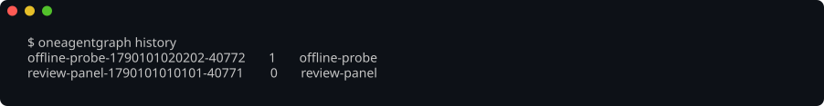

# oneagentgraph


Compose agents into a graph over [oneharness] and [onejudge], and merge their
outputs into **one NDJSON event stream**.

One config file and one CLI call: the graph names an oneharness config per role
and side, and `oneagentgraph` prepares each member's launch, supervises liveness,
and emits every turn, tool call, fallback, and settle as an event you can pipe
into anything.

## Install

```bash
pip install oneagentgraph-cli      # prebuilt binary, no Rust toolchain
npm install -g oneagentgraph-cli   # the same binary, via npm
cargo install oneagentgraph        # from crates.io, compiled locally
```

To install a revision that has not been released yet, build it from the
repository:

```bash
cargo install --git https://github.com/nickderobertis/oneagentgraph --locked
```

Prebuilt archives for Linux (x86-64, arm64), macOS (Intel, Apple silicon), and
Windows (x86-64) are attached to every [release], with `sha256` checksums.

[onejudge] is a **library dependency**, linked into this binary — there is
nothing to install for it. `run`, `smoke`, and `interrupt` drive the [oneharness]
CLI, so that has to be on `PATH`, at the release the [`justfile`](justfile) pins
as `oneharness-version` or newer — `smoke` and `interrupt` ask it for JSON by
name (`--format json`), which an older release refuses as an unknown argument. `health`, `validate`, `history`, `persona`,
`trigger`, `reset-timer`, `cancel`, and `sweep` need nothing at all — `health`
reads oneharness's own identity sweep through its library, in this process.
`ONEAGENTGRAPH_ONEHARNESS_BIN` names a pinned install instead.

A `kind: oneharness` member's turn runs on the linked `oneharness-core` in this
process too, so what that engine reads from the environment it reads from the
graph's `env:` block: with `ONEHARNESS_HISTORY=1` and
`ONEHARNESS_HISTORY_POINTER_FILE=<file>` there, every such turn appends one
pointer line to that file saying where its session went — oneharness's own
contract, read back through the core's `io::history::read_pointers`. Nothing
here writes or sets it; the requirement in [`Cargo.toml`](Cargo.toml) is what
decides the linked core has it, and `tests/inventory.rs` holds it there.

## What it does

```bash
oneagentgraph run graph.yaml --task "add the retry" --output json
```

A graph is YAML — members, the oneharness config each side uses, personas,
schedules, and dependencies:

<!-- llmlint: ignore[contracts_have_one_source_or_a_drift_gate] the version this
example declares is not a second source: `tests/contract.rs`'s
`the_readme_graph_uses_the_current_schema_version` holds this line to
`config::SCHEMA_VERSION`, so the example cannot drift from the schema. -->
```yaml
version: 9
name: node-scope
members:
  worker:
    kind: onejudge
    base_config: ./onejudge.base.yaml
    agent: { oneharness_config: ./oneharness.toml }
    judge:                            # one side, or a list of sides judged as one panel
      - oneharness_config: ./oneharness.judge.toml
        label: reviewer
      - kind: llmlint
        config: ./llmlint.yml
        diff_base: origin/main
      - command: [./scripts/checks]
    mode: bypass
```

`run` streams one envelope per line. Exit `0` means every member settled, `1`
that one failed or died, `2` that the config is invalid. `--output text` renders
one line per envelope as it arrives — the stream at the top of this page, filling
in real time — and is a rendering of those same events rather than a second
report.

A member may name a **persona** — the role delta it layers over its base config,
by built-in name (`persona: engineer`), by a name in the graph's own catalog, or
by path. A persona is a onejudge config fragment: it is written in onejudge's own
field names, and onejudge's schema decides what it may say. [The persona
format](docs/persona-format.md) documents it, including the `agent:` block
earlier versions defined, which is now refused with no compatibility path.
`oneagentgraph persona validate PATH` takes a file or a whole catalog:


> The images on this page are captures of the real CLI, rendered from its actual
> output by [`just screenshots`](screenshots/AGENTS.md) and hash-gated by
> [screencomp](https://github.com/nickderobertis/screencomp) — so they cannot
> drift away from what the binary prints.

A two-party member's `judge:` is a list of sides judged as one panel — a
harness reviewer, an `llmlint` run over the worker's tree, and a repository's
own command, on one worker at once — and a single side is the one-element
shorthand for it. A harness side names an `oneharness_config`, an `llmlint`
side says `kind: llmlint` with its `config` resolved from the graph's own
directory, and a command side names a `command`; each may carry a `label`. A
list of one harness side composes the same onejudge provider it always did;
any other list composes onejudge's `split` provider with the judges in list
order, and each judge's verdict on each worker turn is published as a
`judge-decided` event naming the judge, its kind, its decision and its reason.

A single-sided member may declare `pre_turn` commands — run immediately before
each of its turns, with what they printed prepended to what that turn is asked.
A supervisory member's first act becomes reading a prepared view rather than
spending tool calls rediscovering state that already exists. A view that cannot
be started, fails, prints nothing, or outruns its own bound leaves the turn
happening without it and publishes a `pre-turn-context` saying which.

When a member's turn goes the wrong way, `oneagentgraph interrupt RUN MEMBER
--input "do this instead"` redirects it in place instead of discarding it the way
`cancel` does. Exit `3` means there was no controllable turn in flight, and says
which — a fact, not an error.

**oneagentgraph owns no harness, model, or fallback logic.** oneharness keeps
owning identity chains, fallback, model pins, and quota classification; onejudge
keeps owning the two-party conversation. This composes them.

## Check a graph before you run it

`oneagentgraph validate GRAPH` reads the document, resolves every config and
persona it names, and builds each member's invocation, without launching
anything. A refusal names the member, the entry inside it, and the value it will
not take:


## What past runs did

A run's record is written when it starts and rewritten as it settles, so
`oneagentgraph history` lists the run that is still going alongside the ones that
finished — each with its exit code:



`history show ID` prints that run's whole record — which members it declared and
what became of each, the digest of every config the run resolved, and where the
merged stream was written:


## Identities and quota

`oneagentgraph health` forwards oneharness's own per-identity sweep: which
identities this host has, how each was selected, its auth mode, and the headroom
left in its subscription window. Every probe is free — no harness takes a model
turn — so it is a pre-flight check rather than a thing that costs what it
measures. Here it is swept on a machine with no harness installed at all, which
is why every identity answers with the program it could not find or the reason it
has no headroom to report:


## Reclaiming scratch

Under disk pressure, `oneagentgraph sweep --dry-run` says what scratch exists,
what is reclaimable, and what it could not examine; without `--dry-run` it
reclaims what it proves is dead. `--format json` writes the same report as one
JSON object a script reads by field name, and `--min-age-hours` takes a
non-negative decimal — `0.5` is thirty minutes, the same floor `onevcs sweep`
takes. What counts as proof, and the JSON's shape, are stated in
[the contract](docs/contract.md).


## The command surface

Eleven verbs beside clap's own `help`, in the three groups they fall into:
`run`, `smoke` and `interrupt` drive the [oneharness] CLI; `trigger`,
`reset-timer` and `cancel` signal a run that is already going; and `validate`,
`history`, `health`, `sweep` and `persona` need nothing installed at all. `oneagentgraph <VERB> --help` has the flags for
each, and [the contract](docs/contract.md) is the approved statement of the whole
surface.


## Develop

```bash
just bootstrap   # from a clean clone; installs the oneharness CLI and activates
                 # the pre-push screenshot guard (screenshots/AGENTS.md)
just check       # the deterministic gate: format, clippy, tests, coverage, docs
just gate        # check + the LLM-judge tier; the pre-push bar
```

## Licence

MIT. See [LICENSE](LICENSE).

[oneharness]: https://github.com/nickderobertis/oneharness
[onejudge]: https://pypi.org/project/onejudge/
[release]: https://github.com/nickderobertis/oneagentgraph/releases
